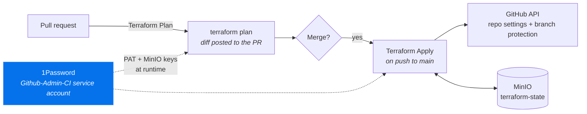

# github-admin

> Terraform-managed GitHub repository settings and branch protection for the entire vollminlab org.

[](https://github.com/vollminlab/github-admin/actions/workflows/plan.yml)
[](https://github.com/vollminlab/github-admin/actions/workflows/apply.yml)


GitHub is infrastructure, so it is managed like infrastructure. Every repository's settings and
branch-protection rules live in `terraform/main.tf`. Changing them means opening a pull request,
reading the plan, and merging — the same loop as any other change in the org.

Clicking through GitHub's settings UI is not the workflow. A manual change becomes drift that the
next `terraform apply` silently reverts.

---

## How it works



| Workflow | Trigger | Does |
|---|---|---|
| `Terraform Plan` | Pull request → `main` | Runs `terraform plan` and surfaces the diff as a required check |
| `Terraform Apply` | Push → `main` (merge) | Runs `terraform apply` |

### Secrets

Nothing is stored in GitHub Actions secrets. Both workflows pull credentials at runtime through the
[1Password GitHub Actions integration](https://github.com/1Password/load-secrets-action), using the
`Github-Admin-CI` service account:

| Secret | 1Password reference | Used for |
|---|---|---|
| GitHub PAT | `op://Homelab/Github-Admin-Token/password` | Managing repos and branch protection |
| MinIO access key | `op://Homelab/Minio-Terraform-Github-Admin/username` | Terraform state backend |
| MinIO secret key | `op://Homelab/Minio-Terraform-Github-Admin/credential` | Terraform state backend |

### State

Remote state in a MinIO S3-compatible bucket at `s3.vollminlab.com` — bucket `terraform-state`, key
`github-admin/terraform.tfstate`. Versioning is enabled, so a bad apply can be rolled back to a
previous state file.

---

## What's managed

12 repositories. Every one has `main` protected with pull requests required, admins included, and
conversation resolution enforced. They differ only in which status checks must pass.

| Repository | Required status checks |
|---|---|
| `k8s-vollminlab-cluster` | Security Scan · Validate Kubernetes Manifests · Validate Terraform Modules · Kyverno Policy Validation · Integration Test · Secret Scanning |
| `pihole-flask-api` | test (3.11) · test (3.12) |
| `VMDeployTools` | Pester Unit Tests |
| `github-admin` | Terraform Plan |
| `vollmint` | Go Tests · Web Tests |
| `longhorn-rebalancing-controller` | Test |
| `shlink-ingress-controller` | Test |
| `homelab-obsidian-vault` | Secret Scanning |
| `ansible-playbooks` | — |
| `groupme_exporter` | — |
| `homelab-infrastructure` | — |
| `masters-league` | — |

Common settings across all repos: `delete_branch_on_merge`, issues enabled, and zero required
approving reviews — this is a single-maintainer org, so the gate is CI, not a second pair of eyes.

> **A blank cell means no check is *required*, not that no CI exists.**
> `ansible-playbooks`, `groupme_exporter`, and `homelab-infrastructure` have no workflows at all.
> `masters-league` does, but `build.yml` triggers on `v*` tags rather than `pull_request` — so no
> check could ever report on a PR there, and requiring one would block every merge permanently.
> Give it a PR-triggered workflow first, then add the context.
>
> The other four were in this position until #19: CI ran on every PR and a red build still merged,
> which is the same gap that let a failing secret scan through on `k8s-vollminlab-cluster` (PR
> #1065) before `Secret Scanning` was added there.

The org's `.github` repository — which holds the public profile README — is intentionally not
managed here; it has no protected branch.

---

## Making changes

```bash
git checkout main && git pull
git checkout -b chore/describe-the-change
# edit terraform/main.tf
```

Open a PR. The `Terraform Plan` check posts the diff. Read it — particularly the destroy count —
then merge, and `Terraform Apply` runs on its own.

### Adding a repository

Define the repository and its protection together, so the two never drift apart:

```hcl
resource "github_repository" "my_repo" {
  name                   = "my-repo"
  description            = "One-line description, shown on the org page"
  visibility             = "public"
  delete_branch_on_merge = true
  has_issues             = true
}

resource "github_branch_protection" "my_repo_main" {
  repository_id = github_repository.my_repo.node_id
  pattern       = "main"

  required_status_checks {
    strict   = true
    contexts = ["CI"]   # must match the job's display name exactly
  }

  required_pull_request_reviews {
    dismiss_stale_reviews           = true
    required_approving_review_count = 0
  }

  enforce_admins                  = true
  require_conversation_resolution = true
}
```

Two things that bite:

- **`contexts` strings must match the check's display name exactly** — not the workflow file name,
  and not the workflow's `name:`. A typo doesn't error; the check simply never becomes required,
  and the branch silently loses its gate.
- **A required check that never reports blocks every merge.** If a workflow only runs on certain
  paths, or its runners are offline, the PR waits forever — and with `enforce_admins = true` there
  is no override. Every repo with a required check therefore pins its runner as
  `runs-on: ${{ vars.CI_RUNNER || 'vollminlab' }}`, so setting the `CI_RUNNER` repository variable
  redirects jobs off the self-hosted fleet without editing a workflow. Add that escape hatch
  *before* you make a check required, not after.

If the repo already has protection applied outside Terraform, import it before planning:

```bash
terraform import \
  -var="github_token=$(op read 'op://Homelab/Github-Admin-Token/password')" \
  github_branch_protection.my_repo_main <REPO_NODE_ID>:main
```

Then confirm a zero-diff plan locally before opening the PR.

---

## Local development

Requires `terraform` and the 1Password CLI (`op`).

```bash
cd terraform

terraform init \
  -backend-config="access_key=$(op read 'op://Homelab/Minio-Terraform-Github-Admin/username')" \
  -backend-config="secret_key=$(op read 'op://Homelab/Minio-Terraform-Github-Admin/credential')"

terraform plan -var="github_token=$(op read 'op://Homelab/Github-Admin-Token/password')"
```

Never run `terraform apply` locally. Applies belong to the merge workflow, so that state changes
always have a pull request behind them.
